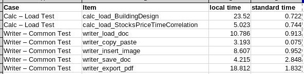

# libreoffice-riscv64-performance-testing

Some work of LibreOffice performance testing for riscv64 port, also work for other arch on linux.

## News

good news! There is only one order of magnitude difference between the performance of LibreOffice on TH1520 (left) and i7-12700kf (right) ~wink*



## How to run

1. Before running the script, install and run libreoffice one time to close the everyday-tips.
2. run the commands below:

```shell
git clone --depth=1 git://go.suokunlong.cn/lo/core
git clone --depth=1 https://github.com/Sakura286/libreoffice-riscv-port-memo.git
cd libreoffice-riscv-port-memo

# modify SRC_CODE_DIR to cloned source code
vim run.sh
chmod u+x run.sh
./run.sh --source_dir ../core
```

## Some memo

Please browse the `doc` folder.
